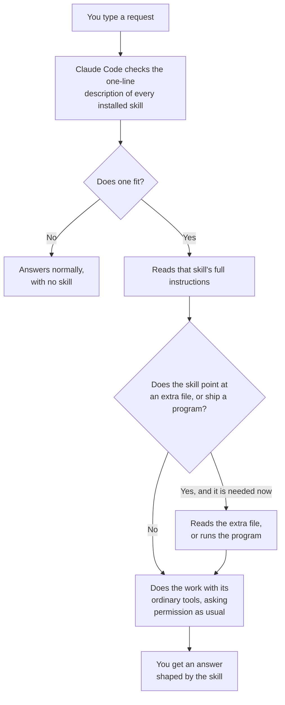

# How a skill works

Part of [skill-library](../README.md).

Worth five minutes if you want to know what you have installed, or why a skill sometimes does not start when you expect it to. If a word here is new, [glossary.md](glossary.md) defines it.

## The short version

You type a request. Claude Code looks at the one-sentence description of every skill it has installed, picks the one that fits, and reads the rest of that skill's file. Then it does the work with the same tools it always uses, asking your permission the same way it always does.

A skill changes how Claude Code goes about a job. It does not give Claude Code any ability it did not already have.

## What happens, step by step

**Claude Code does not read every skill every time.** It reads more of a skill the more relevant that skill becomes.

1. **When the session starts**, Claude Code reads only the name and the one-sentence description of each installed skill. That is a line or two each. Enough to know what exists.
2. **When your request matches a description**, it reads that skill's full instructions. Now it knows the steps, the rules and the shape of the answer.
3. **Some skills point at extra files** holding detail that is only sometimes needed. Those are read only if the job gets that far.

An installed skill you never use costs almost nothing. The skill you are using is read in full.



If the diagram above shows as code rather than a picture, you are reading this somewhere that does not draw Mermaid diagrams. The steps above it say the same thing.

## A skill is text, and some ship small programs

Most of a skill is written instructions in a plain text file called `SKILL.md`. Nothing is compiled. Nothing is hidden.

Some packs here also ship small programs of their own, written in Python, shell or Node, and a skill can run one. A checker that reads a report and says whether it has real output is a program. A script that runs your tests after every turn is a program. Those are the parts that need Python or Node on your computer.

Which packs ship programs, and what each program does, is set out in the table under [Is this safe?](../README.md#is-this-safe-what-does-it-do-on-my-computer) on the main page, and again on each pack's own page.

## Agents

An agent is a helper that Claude Code hands a whole job to. It has its own instructions, it works on its own, and it reports back when it is finished. It does not see your conversation unless it is told about it, which is the point when you want a second opinion from something that did not write the work.

Some packs here include one or two. You do not start an agent yourself. A skill asks for one, or Claude Code decides the job suits one.

An agent can be set up without some of Claude Code's tools, and several here are. That is a real limit, enforced by the software. Several other agents here are held to their stated limits only by their own written instructions, which is weaker. Each pack page says which is which, in as many words. Read that before you trust an agent to stay inside a set of files.

## The one hook

A hook is a small program Claude Code runs by itself at a set moment, without being asked. The `verification-kit` pack installs one. Nothing else here does.

That hook runs before every command Claude Code is about to run on your computer, in every session, whether or not you are using the pack. It only acts inside a fixed list of agents that are meant to look at things and not change them: `pre-delivery-verifier`, `silent-failure-hunter`, `cross-document-checker`, `transcript-scanner`, `loop-operator` and Claude Code's built-in `Explore`. Inside those, it refuses the usual commands that write, move or delete files. Everywhere else it does nothing.

It does not catch every way of writing a file. A write hidden inside another script gets past it. The [verification-kit page](../plugins/verification-kit/README.md) says what it misses.

## Why a skill sometimes does not start

Claude Code chooses a skill from its description alone, before reading anything else in the file. So:

- If your request uses words that are nowhere in the description, it may not match.
- If two skills could both fit, it picks one, and it may not pick the one you meant.
- If nothing fits, Claude Code answers normally, with no skill at all. It does not tell you that it considered one and passed.

When you want one specific skill and nothing else, type its slash command: the pack name, a colon, then the skill name.

```
/consistency-checker:spec-artifact-diff
```

The pack name in front is there so that two packs can each have a skill of the same name without a clash.

## What it costs

**Every installed pack costs a little in every turn.** Claude Code holds the name and description of every installed skill in front of it the whole time, which takes up part of the limited space it has for reading and writing. More installed packs means less room for your actual conversation. This is why the main page suggests starting with one pack rather than all of them.

**The skill you are actually using costs more**, because its full instructions get read.

**Agents cost the most.** Each one is a separate piece of work with its own reading and writing, and a skill that asks for several reviewers at once pays for each of them. Skills here that do that say so on their own page, so you can decide before starting one.

## How to read a skill before you trust it

Every skill in this repository is a plain text file you can read in your browser, before installing anything. Open:

```
plugins/<pack>/skills/<skill>/SKILL.md
```

For example, [plugins/consistency-checker/skills/spec-artifact-diff/SKILL.md](../plugins/consistency-checker/skills/spec-artifact-diff/SKILL.md).

Any programs a skill ships are in the same folder, usually under `scripts/`. Hooks are under `plugins/<pack>/hooks/`. Agents are under `plugins/<pack>/agents/`.

What to look for: what files it reads, what it writes and where, what commands it runs, and whether it goes online. Each pack page states all of that in a table, and you can check the page against the files. If a skill does something the page does not mention, do not install it, and [open an issue](https://github.com/GFMCloud/skill-library/issues).

## Where skills live once installed

Claude Code copies an installed pack into a folder of its own under your home folder. This repository is not the copy being used. Uninstalling removes the copy.

## Where to next

- [which-pack.md](which-pack.md), which pack to install.
- [install-help.md](install-help.md), when something goes wrong.
- [glossary.md](glossary.md), every term in one place.

## Back to the main page

[skill-library](../README.md) lists all the packs and explains the terms used here.
