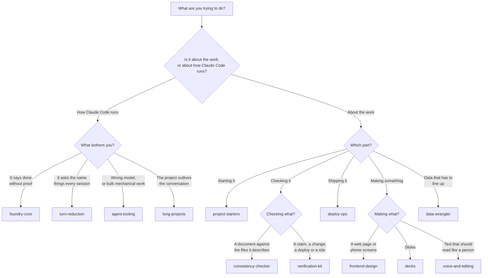

# Which pack do I need?

Part of [skill-library](../README.md).

The main page has a short version of this. This is the longer one, with what each pack does not do and what it needs before it will work.

You do not have to install all of them. Most people want one. Install the pack for the thing you will do this week. You can add another later, and removing one is a single command.

If a word here is new, [glossary.md](glossary.md) defines it.

## Answer the first row that matches you

| What you are trying to do | Pack | It does not | It needs |
| :--- | :--- | :--- | :--- |
| Prove the work is actually done and correct, with the command that shows it | [foundry-core](../plugins/foundry-core/README.md) | Review your code for faults, and judge whether the result is what you wanted. It checks that a check ran, not that the answer is good. | `bash` and `python3` for most of its skills. `proof-of-work` also runs whichever checks your own project uses. |
| Stop Claude Code asking things it could work out, and cut the wasted rounds | [turn-reduction](../plugins/turn-reduction/README.md) | Do the work. `plan-gate` stops at the plan and changes nothing. `standing-authorization` writes a file for you to cut down, and grants a lot before you do. | The `foundry-core` pack, installed for you. Python 3.9 or newer for three of its skills. `plan-gate` uses cloud tools you already have and are signed in to. |
| Check something before trusting it: a claim, a change, a deploy, a website | [verification-kit](../plugins/verification-kit/README.md) | Fix things on its own, apart from `site-review` on a separate branch and `review-pair` after a pass. A security review that finds nothing does not mean the code is safe. | The `foundry-core` pack, installed for you. Node for two of its report checkers. `npx` for `site-review`. It also installs one hook, which its page describes in full. |
| Keep a document true to the files it describes | [consistency-checker](../plugins/consistency-checker/README.md) | Rewrite the document unless you ask it to, and judge whether a claim was worth making. It tests claims a command can settle. | The `foundry-core` pack, installed for you. Nothing else. |
| Keep work that spans many sessions on track | [long-projects](../plugins/long-projects/README.md) | Run unattended unless you set that up yourself. It does not decide the project for you: the harness skills interview you first. | Python, the PyYAML package and `git` for `handoff`. `git` and `gh` for `orch-review` on pull requests. Some skills call skills in other packs of this library, and those parts wait until that pack is installed. |
| Get a new project set up properly before any code | [project-starters](../plugins/project-starters/README.md) | Write your application. It sets up the folder, the history, the checks and the documents around it. | `git`, `gh` signed in, `gitleaks` and `pre-commit` for `new-project`. Nix and direnv for `devshell-init`. Two of its skills were written for the Claude website and need their last step pointed at a local folder. |
| Get a change onto a real address and keep it working | [deploy-ops](../plugins/deploy-ops/README.md) | Choose a host for you, or invent a deploy command. It runs the one your project already has. The migration skill covers Cloudflare Pages and nothing else. | The `foundry-core` pack, installed for you. For the migration: `wrangler` through `npx`, Amazon's `aws` tool, `gh`, and `dig`, `curl` and `diff`, all already signed in where they need to be. |
| Move records between sources and work out which ones mean the same thing | [data-wrangler](../plugins/data-wrangler/README.md) | Guess a match it cannot justify. It lists what it could not match, with a reason, instead of filling it in. Its promise not to overwrite your sources is written instruction, not something the tools prevent. | The `foundry-core` pack, installed for you. No other software. |
| Make a web page or a set of phone screens that does not look like a template | [frontend-design](../plugins/frontend-design/README.md) | Host or deploy anything, and it does not make logos or brand assets. `emil-design-eng` opens with a fixed advertisement for a paid course, which you can ignore. | Nothing installed. `image-taste-frontend` and `mobile-taste-frontend` do more with an image-generation tool connected, and still work without one. |
| Make slides | [decks](../plugins/decks/README.md) | Write your content from nothing. `cd-to-pptx` leaves charts and diagrams as labelled empty boxes for you to fill in. | Python. `cd-to-pptx` also needs LibreOffice, poppler and `python-pptx`, and installs missing ones itself rather than asking. `html-diagram` needs Playwright and its Chromium download. |
| Decide how a job should be run, and look things up in past sessions | [agent-tooling](../plugins/agent-tooling/README.md) | Do the task itself. It advises on the model, the effort and whether a large automated workflow is worth it. | Ollama, running on your computer with a model downloaded, for `llama-offload`. Nothing else. |
| See how one person set up a writing voice and a set of personal tools | [voice-and-editing](../plugins/voice-and-editing/README.md) | Give you a voice of your own without editing. `graham-voice` is one named person's voice. `capability-index` is empty until you fill it in. Read the pack page before installing. | Varies by skill. `x-read` needs an Apple computer, Node 22 or newer, and your own X sign-in stored once by its setup script. Others need `git`, `gh`, `gitleaks`, Python or Docker. |

If more than one row matches, install the pack for the row you will use first.

## As a flowchart



If the diagram above shows as code rather than a picture, you are reading this somewhere that does not draw Mermaid diagrams. The table above it says the same thing.

## Packs that bring another pack with them

`consistency-checker`, `data-wrangler`, `deploy-ops`, `turn-reduction` and `verification-kit` each need `foundry-core` to work. You do not install it separately. Claude Code installs it at the same time, and the install message says `+ 1 dependency: foundry-core`. That is expected. It means one extra pack on your machine, so if you install two of those five, `foundry-core` is still there only once.

Skills in `long-projects` also name skills in other packs of this library. Those steps wait until the named pack is installed. The pack page lists which ones.

## One pack is one person's own tools

`voice-and-editing` is different from the rest. It is the author's own writing voice and the tools he built around his own computer, his own accounts and his own projects. It is published so you can read it and change it, not as a set of defaults for you.

Some of it works for anyone as it stands. Some of it names a folder, a naming rule, an account or a way of speaking that is his. The [pack page](../plugins/voice-and-editing/README.md) says which skills are which. Read it before you install.

## What all of them leave to you

None of these packs replaces your judgment. A check can pass when it should fail. A review can miss something. Several of the limits listed on the pack pages are written instructions to Claude Code rather than anything your computer enforces, and each pack page says plainly where that is the case. Read the pack page before you install, and read the [safety table on the main page](../README.md#is-this-safe-what-does-it-do-on-my-computer) before you install anything from anywhere.

## Still not sure

Install `foundry-core`. It is the one the others build on, it needs nothing else, and removing it is one command:

```
/plugin uninstall foundry-core@skill-library
```

If the install itself gives you trouble, see [install-help.md](install-help.md).

## Back to the main page

[skill-library](../README.md) lists all the packs and explains the terms used here.
